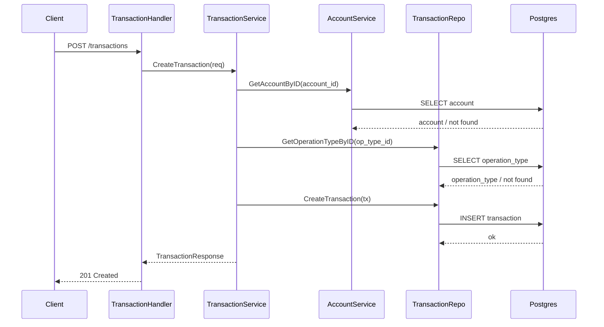

# Transaction Manager

**Installation Guide & Curls (Request/Response)**

Prerequisites:
- Docker installed (Docker Desktop or Docker Engine + Compose).
- Go toolchain (for `go mod tidy` and tests).

Before first run:
```bash
go mod tidy
```

Run the stack (builds images, boots DB, runs migrations, then starts API):
```bash
./run
```

Stop everything:
```bash
./stop
```

Base URL: `http://localhost:8080`

Create account
Request:
```bash
curl -X POST http://localhost:8080/accounts \
  -H 'Content-Type: application/json' \
  -d '{"document_number":"12345678900"}'
```
Response:
```json
{
  "account_id": 1,
  "document_number": "12345678900"
}
```

Get account
Request:
```bash
curl http://localhost:8080/accounts/1
```
Response:
```json
{
  "account_id": 1,
  "document_number": "12345678900"
}
```

Create transaction
Notes: `amount` must be positive and have up to 2 decimals. The signed amount is derived from `operation_type_id` (`debit` => negative, `credit` => positive).
Operation types (seeded by migrations):
| ID | Description | Transaction Type | Meaning |
| --- | --- | --- | --- |
| 1 | Normal Purchase | debit | Purchase, reduces balance |
| 2 | Purchase with installments | debit | Installment purchase, reduces balance |
| 3 | Withdrawal | debit | Cash withdrawal, reduces balance |
| 4 | Credit Voucher | credit | Credit, increases balance |
Request:
```bash
curl -X POST http://localhost:8080/transactions \
  -H 'Content-Type: application/json' \
  -d '{"account_id":1,"operation_type_id":4,"amount":123.45}'
```
Response:
```json
{
  "transaction_id": 1,
  "account_id": 1,
  "operation_type_id": 4,
  "amount": 123.45,
  "event_date": "2026-04-09T03:27:38.633+05:30"
}
```

E2E tests
Make sure the stack is running first:
```bash
./run
```
Then run:
```bash
go test ./e2e
```

**About The Project**

TransactionManager is a simple REST API for managing accounts and their financial transactions. It validates inputs, ensures accounts exist, looks up operation types, and records transactions with a signed amount based on debit/credit type.

Key behaviors:
- Accounts are uniquely identified by `document_number`.
- Transactions require a valid `account_id` and `operation_type_id`.
- Amounts must be positive with at most two decimal places.
- Operation types are seeded via migrations and determine signed amount.

**System Architecture**

Components:
- HTTP API built with `chi` in `cmd/api`.
- Service layer in `internal/*/service` for validation and business logic.
- Repository layer in `internal/*/repo` for database access via GORM.
- PostgreSQL database managed with Goose migrations in `cmd/migrations` and `internal/migrations`.
- Docker Compose orchestrates `postgres`, migrations, and the web service.

Directory structure (high level):
```
cmd/
  api/                 # HTTP API entrypoint
  migrations/          # Migration runner
config/                # App configuration (dev/docker)
internal/
  account_service/     # Account domain (handlers, service, repo, models)
  transaction_service/ # Transaction domain (handlers, service, repo, models)
  migrations/          # Goose migrations
packages/
  logger/              # Logging wrapper
  public_response/     # API response helpers
  server/              # HTTP server wiring/middleware
e2e/                   # End-to-end tests
```

UML (sequence - create transaction):

